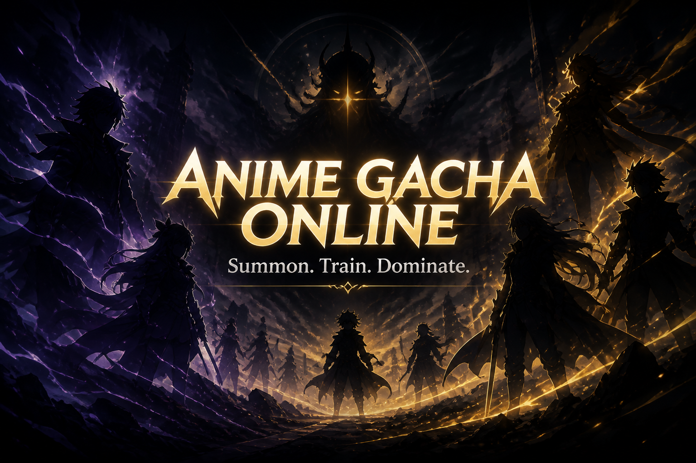



  

<h1 align="center">Anime Gacha Online</h1>

  <strong>Summon legends. Forge traits. Own the lobby.</strong> 
  A flashy anime gacha you play as a real Windows desktop app — not a lonely browser tab.

  
  

  <a href="https://github.com/mjedit100-cmyk/anime-gacha-online/releases/latest"><strong>⬇ Download the latest Setup.exe</strong></a>

---

## What is this?

**Anime Gacha Online** is a collect-and-clash anime gacha: pull rare units, roll traits, raise familiars, clear story, and drip AFK rewards while the lobby vibes hard.

Built for the kind of player who wants:

- Big summon energy (pity, banners, cinematic pulls)
- Units that actually feel different once you kit them
- A desktop client that **updates itself** so you stay on the live build

---

## What’s in the game

| Pillar | The vibe |
| --- | --- |
| **Summon** | Classic multi-banner pulls, pity, featured rotations, Eminence exclusives |
| **Traits & Familiars** | Roll power onto units; familiars are star-rated copies you equip |
| **Story & Battles** | Campaign progress, card combat, training sandpit for kit tests |
| **AFK Chamber** | Park a unit, come back to coins and drip — Burnice BGV energy |
| **Events & Mail** | Limited modes, inbox gifts, wiki codes for the culture |

---

## Get playing (Windows)

1. Open the **[latest release](https://github.com/mjedit100-cmyk/anime-gacha-online/releases/latest)**
2. Download **`Anime-Gacha-Online-Setup-….exe`**
3. Install → launch from desktop / Start Menu
4. First boot shows a short **client gate** (update check), then you’re in

Already installed? Just launch the app — if a newer build exists, the gate downloads it before the lobby opens.

---

## Auto-update

The desktop client checks this releases page for `latest.yml` + the Setup package.

- Stay current without hunting installers
- Outdated clients get blocked at the gate until they update
- Your save lives on your PC across updates (not wiped by a patch)

---

## Good to know

- **Windows** desktop app
- Need an older build? Browse **[all releases](https://github.com/mjedit100-cmyk/anime-gacha-online/releases)**

---

  <em>Pull once. Pull twice. Blame the pity.</em> 
  Anime Gacha Online · MJdev

